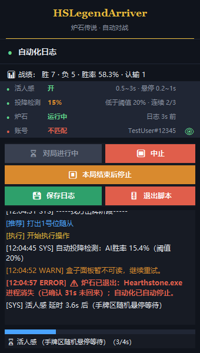
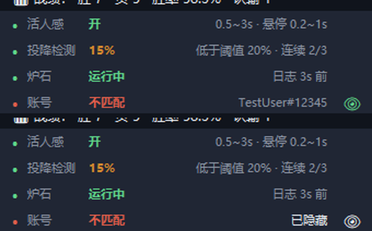
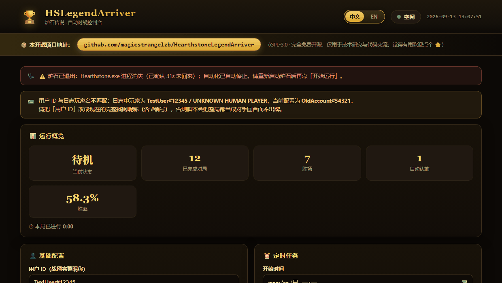
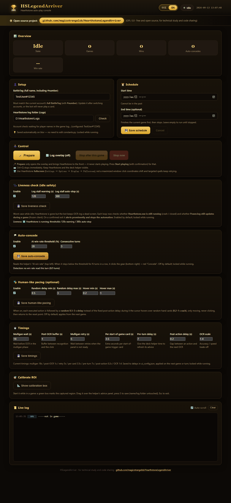

<div align="center">

# 🏆 HSLegendArriver（胜率63.8的炉石传说脚本）

### 帮你走完上传说的路

**读取炉石日志 + 获取炉石盒子打法建议 + 自动执行操作**

**33 分钟：钻石 2 → 传说**  
**一下午：冲到传说约 6000 名**  
**多盘实测胜率：机械骑 82.4%（17 局 14 胜）、号角骑 65%、弃牌术 63.8%**

<br>

> 🔥 已实测支持：**机械骑 / 号角骑 / 弃牌术 / 海盗瞎**  
> 🤖 自动识别对局、读取推荐打法并完成出牌操作  
> 🩺 炉石闪退/卡死会**醒目告警并自动停止**，不会对着失效画面空转到天亮  
> 🌐 界面支持中文 / English（网页右上角切换）

</div>

---

## ✨ 项目简介

**HSLegendArriver（传说到达者）** 是一个用于《炉石传说》的自动化打法执行器。

项目通过读取炉石对局日志，并结合 **炉石盒子「推荐打法」** 提供的推荐操作，自动识别当前对局状态并执行对应的鼠标点击与键盘操作。

简单来说：

> **炉石盒子负责告诉你"怎么打"，HSLegendArriver 负责帮你"打出去"。**


## ⚠️ 先看两条最容易忽略的配置

> 这两条不看，脚本会「看起来在跑、实际什么都不做」或「一直重试到天亮」。

**一、炉石必须用「全屏模式」，不要用「最大化窗口」。**
点击坐标是按 **1920×1080 全屏** 写死的，窗口化 / 最大化时画面有偏移，**所有点击都会错位**：下随从因为有吸附看着还能成，**法术指定目标会持续失败重试**。
设置位置：`设置 → 选项 → 显示 → 显示模式 = 全屏`，同时桌面分辨率 **1920×1080**、Windows 缩放 **100%**。

**二、换战网账号后，必须把「用户 ID」改成当前账号的完整昵称（含 #编号）。**
脚本完全靠昵称区分敌我。昵称不一致时，**整局都会被判成「对手回合」而一张牌都不出**，日志里也看不出报错。
现在脚本会自己比对日志里的玩家名，不一致时在网页顶部、浮窗「账号」行和日志里提示你。

## 🐍 安装

1. 装 **Python 3.12**（<https://www.python.org/downloads/>，安装时勾选 "Add python.exe to PATH"）。
2. 代码放在**没有中文的路径**下，在项目根目录执行：

   ```
   pip install -r requirements.txt -i https://pypi.tuna.tsinghua.edu.cn/simple
   ```

   依赖含 PaddleOCR / PaddlePaddle，比较大，耐心等。
3. **以管理员身份**打开 PowerShell，进入项目目录运行 `python web_ui.py`，浏览器会自动打开 `http://127.0.0.1:8765`（端口被占用会自动换，以控制台输出为准）。
4. 打开炉石传说和炉石盒子；炉石显示模式设为**全屏**。
5. 首次使用点网页里的「**校准推荐区域**」：屏幕上出现绿框（= 程序截图范围），拖到盒子顶部「打法参考A」面板上，按 **S** 保存、**Esc** 退出。换了盒子窗口大小要重新校准。

## 🕹️ 使用

- 点「**开始运行**」只开浮窗、把炉石切到前台，**不会开打**；就绪后按钮变成「开始对战」，再点一次（二次确认）才真正开始。
- 「本局结束后停止」随时可以再点一次取消；`Ctrl+Q` 立即停止；「定时任务」到点后先打完本局再停。
- 换牌、回合、OCR 各级延时都能在网页里调，写进 `ui_config.json` 立刻生效（运行中锁定）。

屏幕右上角会出现**置顶半透明**的日志浮窗：



- 顶部是战绩；下面四行状态：活人感、投降检测、炉石（存活检测）、账号（昵称是否匹配）；
- 日志按类型着色：我方回合绿、`[推荐]`蓝、`[执行]`金、`[SYS]`白、`[WARN]`橙、报错与告警红；
- 「账号」行右侧的眼睛可以隐藏 / 显示战网昵称（绿=显示，白=隐藏），录屏时用；
- 底部是延时进度条；「保存日志」写入项目 `logs/` 子目录。



## 🩺 存活检测（挂机防空转）

炉石闪退或被关掉时，脚本以前会继续对着失效画面做 OCR，空转几个小时。现在每个循环都会检查：

| 情况 | 处理 |
| --- | --- |
| `Hearthstone.exe` 进程消失（本轮见过它） | 6 秒宽限后判定已退出：**醒目告警 + 自动停止** |
| 对局中 `Power.log` 超过 120 秒没更新 | 橙色告警，继续观察 |
| 对局中 `Power.log` 超过 300 秒没更新 | 判定无响应：**醒目告警 + 自动停止** |

进程信号最可靠（闪退、被杀、手动关闭都能发现）；日志信号只在对局中参考——匹配对手、选职业阶段日志本来就安静。判不出来时（例如没权限读进程列表）绝不会误停机。阈值在网页「存活检测」卡片里改，默认开启。



## 🌐 界面语言

网页右上角可以切换中文 / English，选择记在 `ui_config.json`，浮窗和日志提示会一起变。


英文界面（同一个页面）：



## 🎭 其它可选功能

- **自动投降**：检测左上角盒子的「AI胜率」，连续 N 回合低于阈值就点齿轮 → 认输，避免控制卡组的折磨。默认关闭，网页里实时显示检测状态。
- **活人感**：每次出牌后不用固定延时，而是 0.5~3 秒随机延时，期间鼠标在手牌区随机悬停（只移动不点击），最后复位。默认关闭。

## 🃏 已测试卡组

<details>
<summary>号角骑 / 机械骑 / 弃牌术（点击展开卡组代码）</summary>

```
AAEBAaToAgaD3gO2igS8jwbOnAbRqQblwQcMiA740gKR5APJoAThpATBxAXI+AWFjgaZjgb1lQaDwgea/AcAAA==
```
```
AAEBAaToAgiftwPM6wP5pAS5/gXHpAaf4Qa/+Qad3QcLpfUCh64DkrUE1L0E2tMEhKUF2dAF4vEGupYH2uIHmvwHAAEE1/4Cnd0H87MGx6QG9rMGx6QG6N4Gx6QGAAA=
```
```
AAEBAa35AwaPggPV0QP5xgXxoQb2oQbGsgcMzge1uQPQ4QOYkgWrkgWVygbXlweEmQekrQfWvgfZvgfPvwcAAA==
```

</details>

## 🛠️ 环境要求

| 项目 | 要求 |
| --- | --- |
| 操作系统 | Windows |
| Python | 3.10 – 3.12（推荐 3.12；不支持 3.13+） |
| 炉石传说 | 已安装，显示模式为**全屏** |
| 炉石盒子 | 已安装，简体中文，左侧「推荐打法」完整显示 |
| 桌面 / 炉石分辨率 | **1920 × 1080**，Windows 缩放 **100%** |
| 权限 | 用**管理员**身份启动 Python |
| 其它 | 炉石与盒子窗口不要被其他窗口遮挡 |

## 🤝 Contributing

如果你在使用过程中遇到问题，或想反馈 Bug / 功能建议，欢迎在 Issue 中提供：问题现象 + 游戏界面截图 + 运行环境。

## 🧩 开发约定

- **一个功能一个 commit**：不同功能的改动分开提交，不要把不相干的修改混在一个 commit 里；README / 文档改动可以跟对应功能同一个 commit。
- **界面文案统一放在 `i18n.py`**：网页用 `data-i18n="键名"`，Python 用 `t("键名")`。
  **新增或修改文案时必须同时补 `zh` 与 `en`** —— `tests/test_i18n.py` 会检查两种语言键一致、英文里没有残留中文、占位符一致、网页与代码引用的键都存在，还会实测浮窗状态面板放不放得下两种语言。
- 跑测试（项目根目录，逐个模块列出来）：

  ```
  python -m unittest tests.test_i18n tests.test_hearthstone_liveness tests.test_fsm_liveness_stop tests.test_player_name_match tests.test_web_liveness_api tests.test_overlay_eye_and_colors
  ```
- 自动化过程日志（推荐 / 执行 / 延时明细）目前仍是中文，后续改动涉及这些文案时一并补英文。

## ⭐

如果你觉得这个项目有意思或帮到了你，欢迎点一个 **Star ⭐**，这对我真的很重要！

> **如果真的靠它上传说了，回来留个 Star 吧 😎**

---

## 🙏 致谢

本项目参考了以下开源项目：

- [Yiyuan-Dong/AutoHS](https://github.com/Yiyuan-Dong/AutoHS)
- [FallAbyss/AutoHS](https://github.com/FallAbyss/AutoHS)

## ⚠️ Disclaimer

本项目仅用于 **技术研究与代码交流**。本团队声明反对长期滥用脚本的行为，严禁将此开源项目用于商业用途。

---

<div align="center">

### 🏆 HSLegendArriver

**让 AI 帮你走完最后一段上传说的路。**

## ⭐ Star 一下吧 ⭐

</div>
